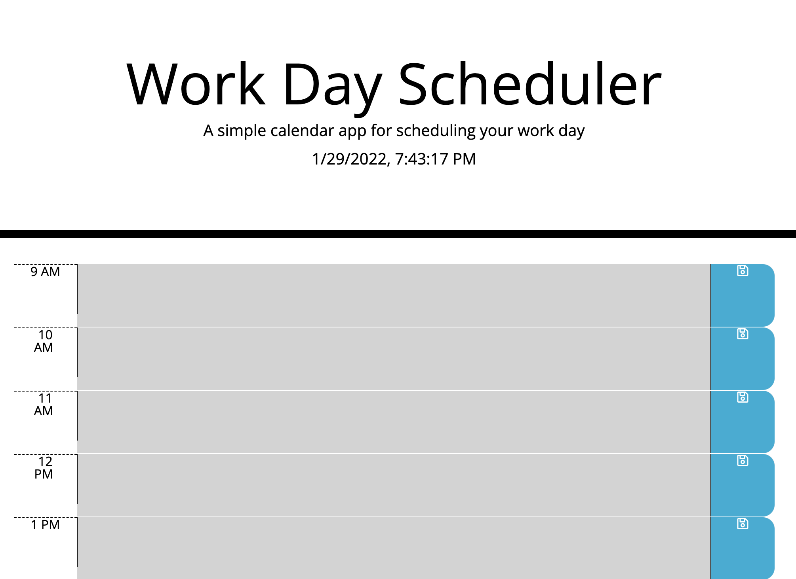

# Work Day Scheduler

## Description

This will allow employees with a busy schedule to be able to add events to a daily planner. Therefore, the employees will be able to manage their time better.

They will be able to do the following:
* View time blocks for standard business hours (9 am to 5 pm)
* Click into the text area
* Save the tasks into the business hour
* Save into local storage
* View stored items even after refreshing the page

## Screenshot

## Link
https://christine-zhe.github.io/scheduler/
